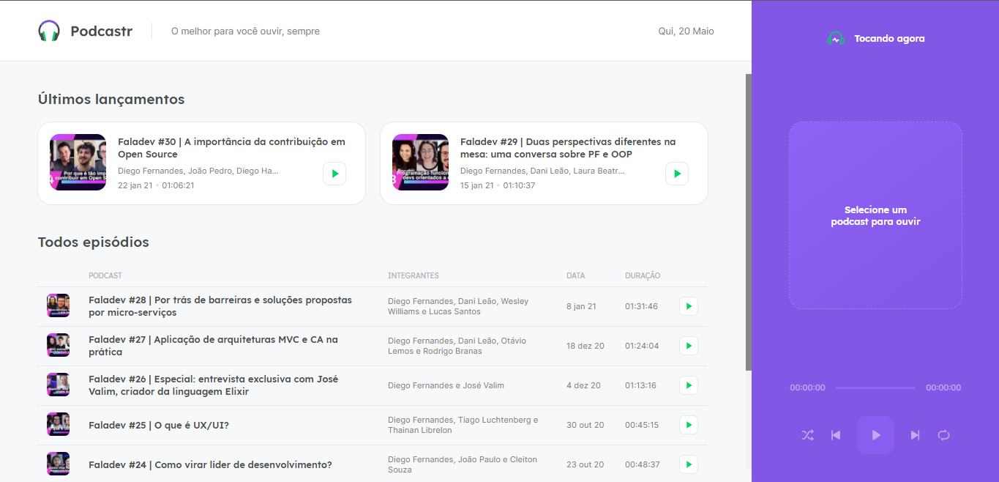
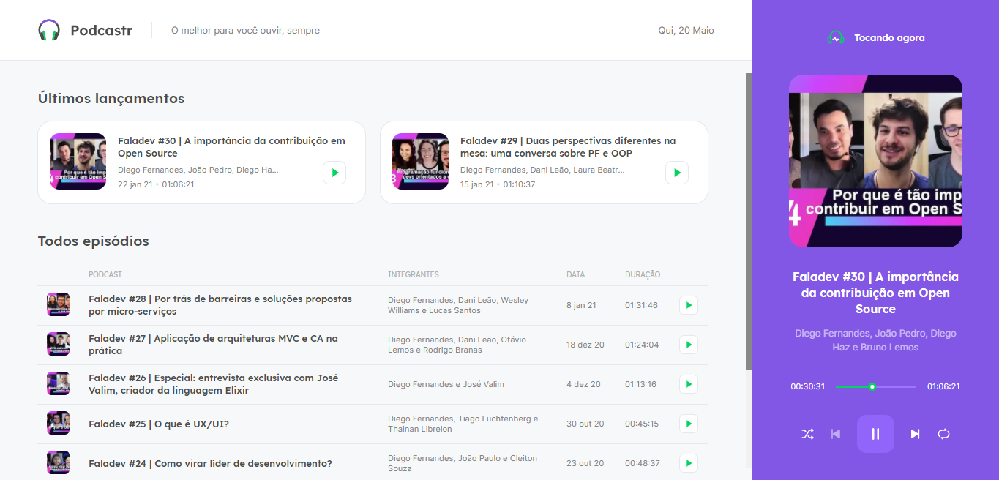
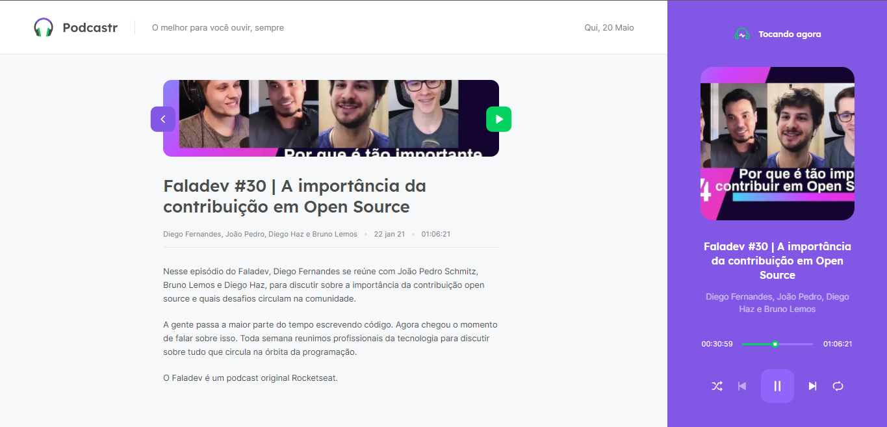

# podcastr

<div align="center">
  
</div>

<h4 align="center">
  Podcastr é uma plataforma construída para transmissão de podcast.
</h4>


## Screenshots
<div align="center">
  
  
  
</div>

## Tecnologies

- [ReactJS](https://reactjs.org/)
- [Typescript](https://www.typescriptlang.org/)
- [Next.js](https://nextjs.org/)
- [Sass](https://sass-lang.com/)

## 💻 Getting started
### Requirements

- You need to install both [Node.js](https://nodejs.org/en/download/) and [Yarn](https://yarnpkg.com/) to run this project.

**Clone the project and access the folder**

```bash
$ git clone https://github.com/leonardolucena/podcastr && cd podcastr
```

**Follow the steps below**

```bash
# Install the dependencies
$ yarn

# Run the backend fake server
$ yarn server

# Run the web server
$ yarn dev
```

The app will be available for access on your browser at `http://localhost:3000`
